# Admin Manual

## Getting started with Anne

### Overview

Anne is a E-Commerce platform that allows anyone to set up an online store and sell their products. Administrator will have enormous number of features from where he/she can control the flow of the anne.

Vendor(seller) can control their store by the easy to handle dashboard. Vendor has the ability to manage sales,products,orders,payments,customers,import and export,monitoring etc. vendor can also see the analysis reports of the performance of the store.

This guide will help you through the basic steps to open your Anne store and start selling within a day. Once you sign up and set up your store, you don't have to do anything else — your store is up and running. Meaning it's open, and customers can check your storefront and make orders.

Okay, let’s get started!

### SignUp

- You can sign up to Anne Platform on your browser. All you need is an valid email address, and You can set up account.
- If you are not registered to website then you can create a new account using sign up.
- After filling all details, click on sign up button, after this server will check the provided info is valid or not, if it is valid then it will create your account or if it detects that the info is invalid then you have to fill the details carefully.
- Email must be unique, not registerd with us already.
- You can fill details as in image below

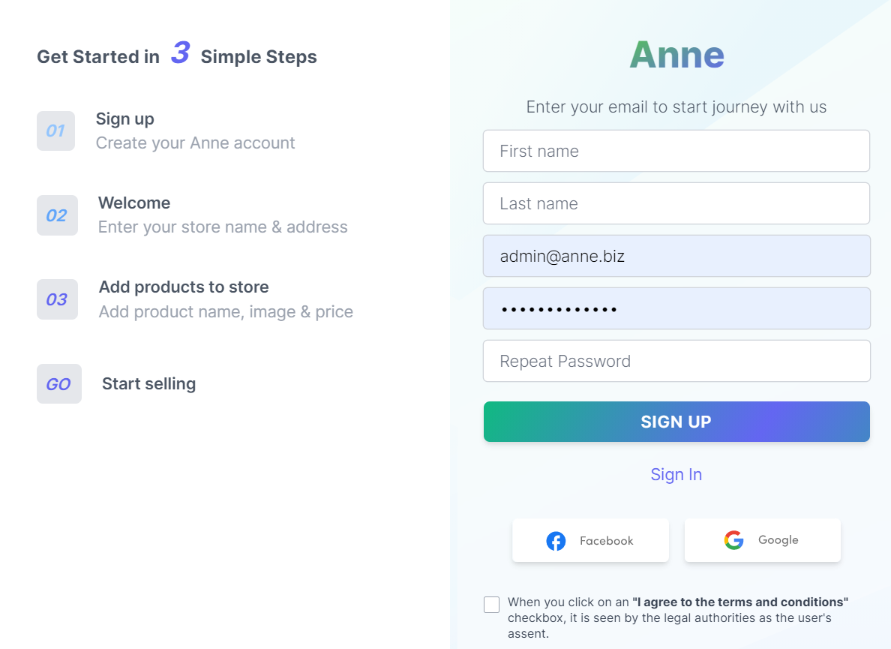

### Sign In And Sign Out

- You can log in to Anne on your browser.

#### To log in

- Go to the Anne admin panel login page.
- If you signed up with an email address and password, enter them and click Sign In.
- password should be case sensitive.
  
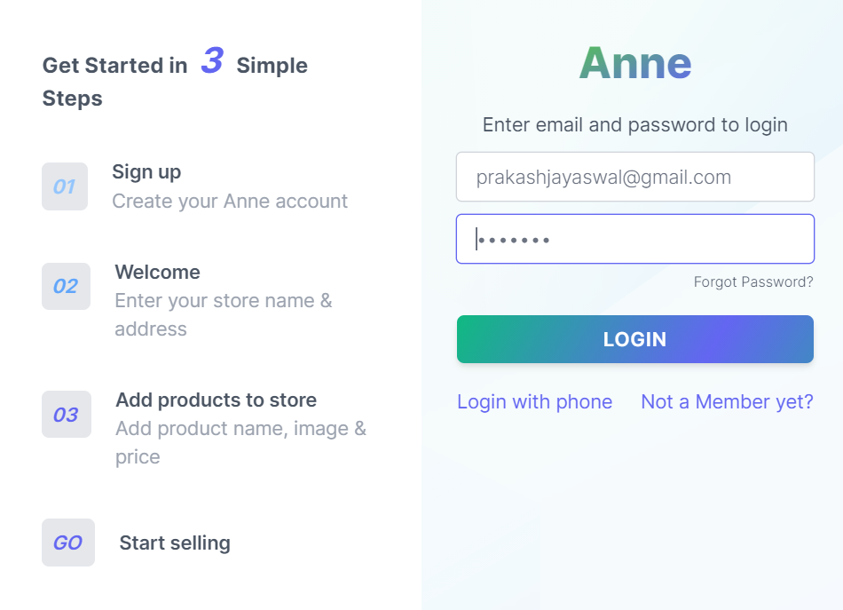

#### To log out

- Go to your Anne admin panel at [https://admin.anne.biz/](https://admin.anne.biz/)
- Click on your left sidebar bottom at logout.

### Resetting Password

- You can reset your login password any time if you forget it, or if you want to keep your account more secure.

#### To reset your forgotten password

- Go to go to [https://admin.anne.biz/](https://admin.anne.biz/)
- Click on Forgot password
- Enter email address which is associated with your Anne account and click Send email.

  
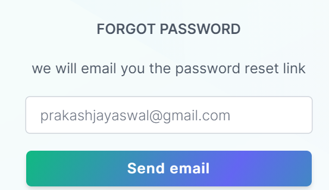

- An email with a link will sent you for reset your password. In the email, click on reset password link.
- Create a new password for your account and click Reset password
- Now You will be able logged in to your Anne account with your new password.

  
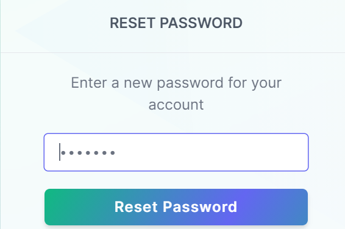

<!-- ### Store Set Up

- After Successfull signup, it will redirect to Store set up page , it will ask for the store configuration.

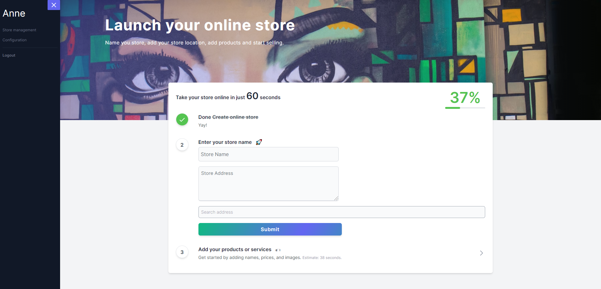

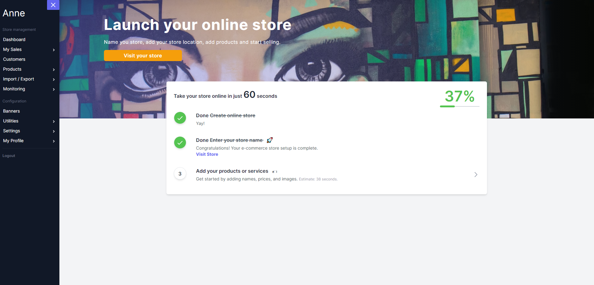

The fields shown above have to be filled by you to open up a new shop and after store set up you will be able to access the store feature. -->

### Dashboard

You can visit the dashboard page only After successfully loggedIn, Menu page will be listed in the left corner of the page & the 1st option that will be opened is Dashboard.

In the Dashboard there are different option that we can see such like

- Total Orders→ Total how many orders have been placed for vendor’s products will be shown here as a count.
- Total users→ Total how many users in store will be shown here as a count.
- Total products→ Total how many products in store will be shown here as a count.
- Total payments→ Total how many payments done in store will be shown here as a count.
- Earning→ It will show the total amount of orders placed in a month.
- Latest Orders→ This block will show the latest five orders placed on the store for the vendor’s products. Latest orders will have a different background color on the basis of the order status.
- Transactions→ This block will show the latest five payments on the store for the vendor’s products.

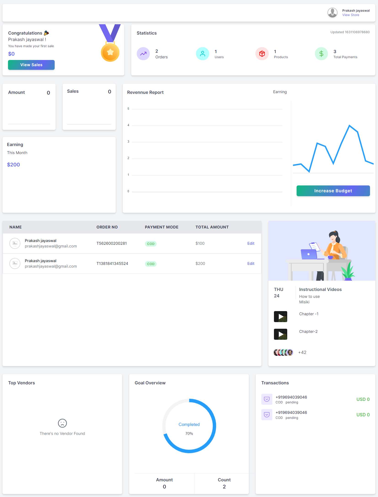

### SideBar

- Anne sidebar is a useful component of website navigation design. You can see all the service in one place through the anne sidebar, you can manage as per need.

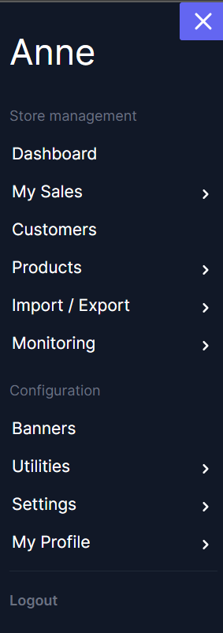

### Profile

- You can go to My Profile → profile in sidebar bottom.
- Here you can update your profile information.
- You can also close your account from here.

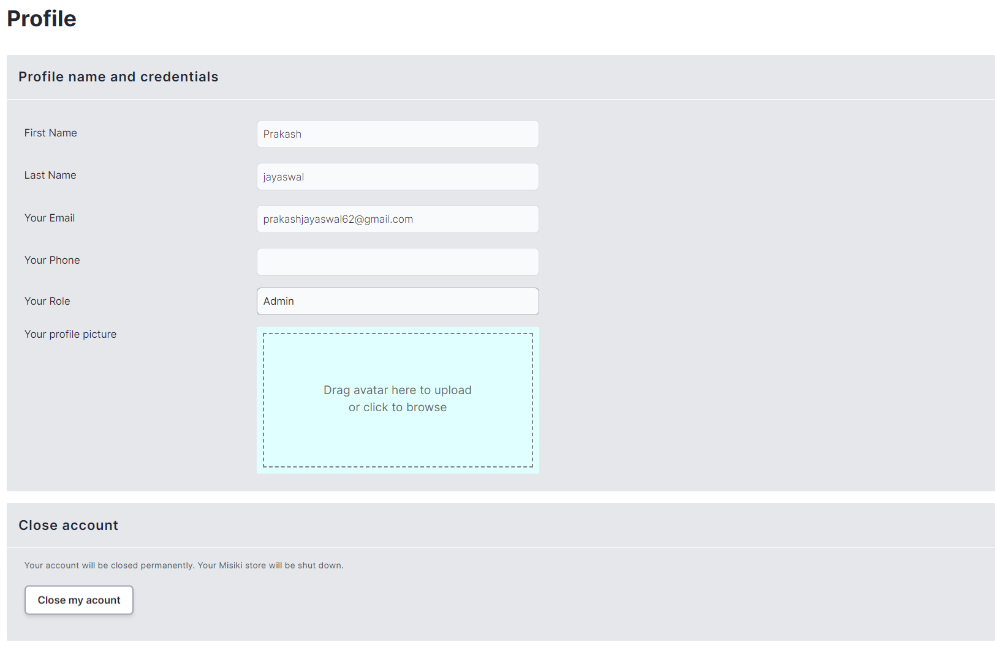

## Configurations

In sidebar , go to Settings → Store Settings.

### Email Configuration

By default, the system is set up to log all mails into files. You have to configure this settings to send emails. You may use any of this supported services→ smtp, sendmail, mailgun, mandrill and sparkpost. To configure email, open the .env file and update these keys with your values.

::: warning

> The system will generate errors if the mail fails. So double check the email configuration. Talk to your email/hosting service provider if you’re not sure what to do.

:::

#### Testing Emails

If you don’t have a mail server or just testing the application you can fake the actual sending of emails. zCart has a log driver and the Mailtrap driver for this job.

**Log Driver**

Instead of sending your emails, the log mail driver will write all email messages to your log files for inspection. All emails will be stored in storage/logs/zCart-date.log files. The default email driver is log, so you don’t have to do anything to configure this driver.

**Mailtrap**

Finally, you may use a service like Mailtrap and the smtp driver to send your email messages to a “dummy” mailbox where you may view them in a true email client. This approach has the benefit of allowing you to actually inspect the final emails in Mailtrap’s message viewer.

- MAIL_DRIVER=log
- MAIL_HOST=smtp.example.com
- MAIL_PORT=587
- MAIL_USERNAME=user
- MAIL_PASSWORD=secret
- MAIL_ENCRYPTION=tls
- MAIL_FROM_ADDRESS=no-reply@example.com
- MAIL_FROM_NAME=No-Reply
- MAIL_REPLY_TO_ADDRESS=reply@example.com
- MAIL_REPLY_TO_NAME=Reply

The MAIL_FROM_ADDRESS and MAIL_FROM_NAME will be used to sent email by your marketplace where no specific sender information available to use.

### System Settings

### Store Profile

**Store Name and Web Address**

- Your store name is the name under which your store appears to customers.
- Your store location defines which web address is displayed on customer-facing invoices and emails, and is also used when sharing products via social networks.

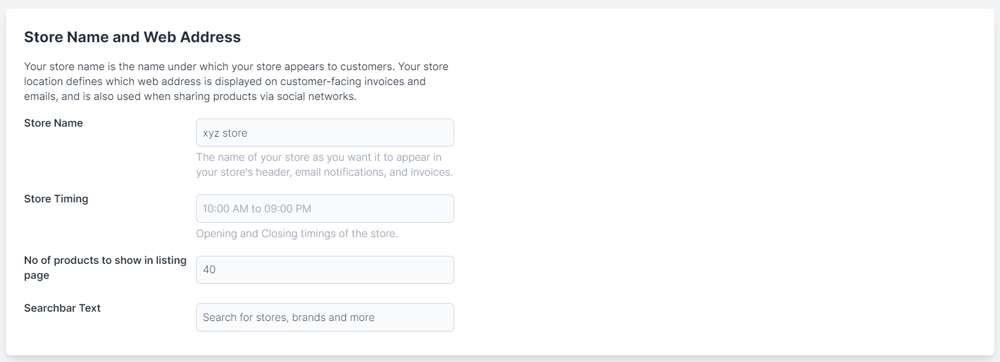

**Store Currency**

- You can add currency name and currency symbol.

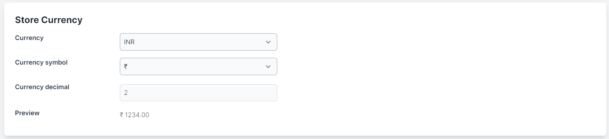

**Company Name and Email**

- The official name of your business. If you don't have a registered business yet, specify your store name as the company name.
- You can also add email of the company.

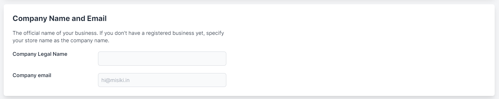

**Company Address**

- You can fill your company address here with phone number.
- You can also search your store location in search address field.

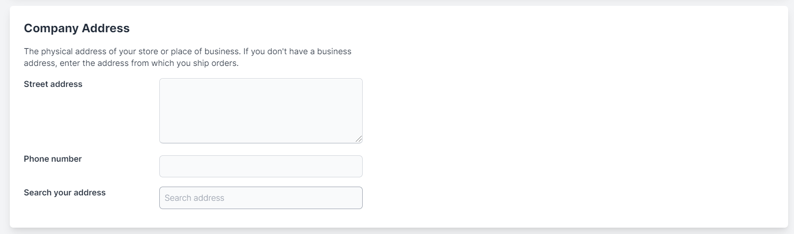

**Social Media Accounts**

You can provide your social media url of your store, so customer can easily visit your store and its products.You can link account as follows

- Facebook
- Instagram
- Linked In
- Twitter
- Youtube
- Pinterest
- Google

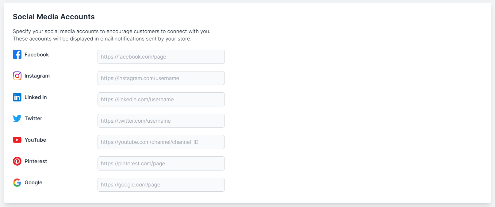

**Storefront is Open**

In case you want to store status from open to close with a note, you can use this feature.

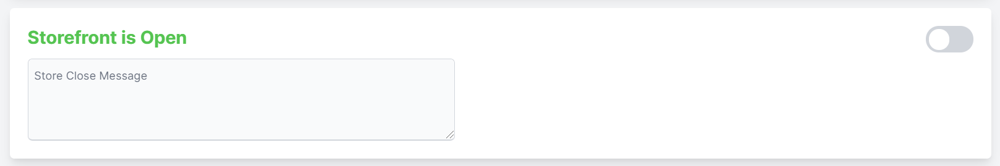

**Custom Domain**

- A domain is a unique address of your website on the Internet. People use the domain to locate and visit your site. Besides, it defines your brand and produces an instant, but lasting impression. It also affects your site position in the search engine results as the right keywords in your domain name improve your SEO ranking.

- If you already own a domain name, go ahead and connect the domain to your Anne Instant Site. In case you don't have one yet, you can buy a domain from any third-party company that sells domain names.

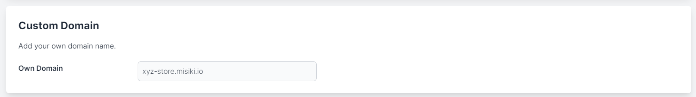

**Store Description**

- Information about your store. You may also use videos, images, and animated elements that help to describe your store. Write unique description for rank higher in search engines.

- Store description section has the editor, so you can easily add text (and change color, size, and font), bullet points, paragraphs, links, or additional images and videos.

- Tips to improve your store descriptions

  - Avoid long sentences and complex vocabulary.

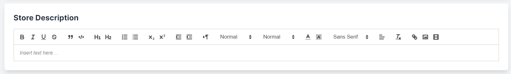

### Store SEO

SEO (or Search engine optimization) is the process of improving your site's ranking in search results in engines like Google, DuckDuckGo to generate free traffic to your online store. While some things can be manual, Anne has the technical side covered for you –– all stores are optimized for search engines by default.

**Preview**

- You can preview store through this link.

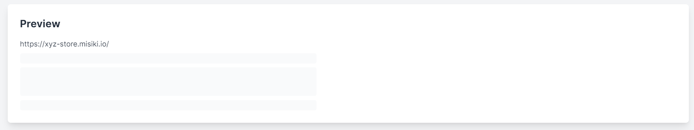

**Company SEO Attributes**

- You can add company SEO attributes like- tile ,metadescription etc.

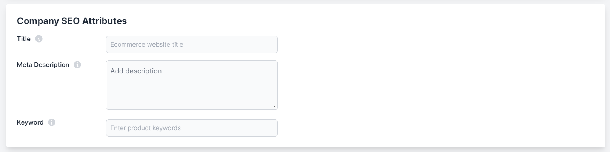

### Store Images

You can upload images of the store , logo of your store and youtube video and more.

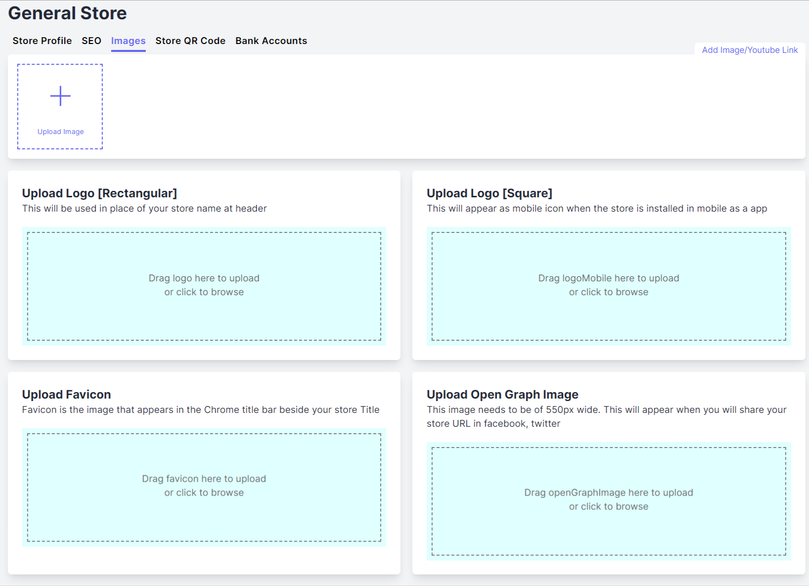

### Store QR Code

- Your Anne store QR Code is generated as soon as you create your store.
- You can share and download your QR Code from the sidebar settings → store.

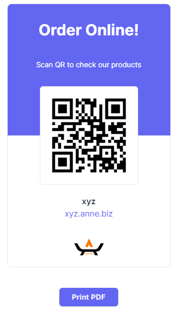

### Store Bank Account

In This section store owner can fill account details, so order amount reflect in that account.

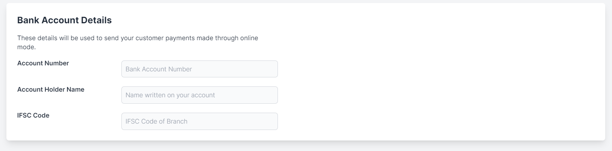

## Banners

Banners are used to make your store attractive to the customers.These banners contain image of sales, discounts and more.

**Anne store have four types of banners as follows**

- Slider→ This section controls the main page slider.
- Hero→ This banner used for page medium content.
- Picked→ This banner will comes in smallest and can use for brands.
- Video→ This banner contain video.

**Create Banner**

- Click on plus icon for create new banner.
- Choose image and fill detail.
- Banner type will decide the banner look and position.
- Banner link will redict user to page on that link.

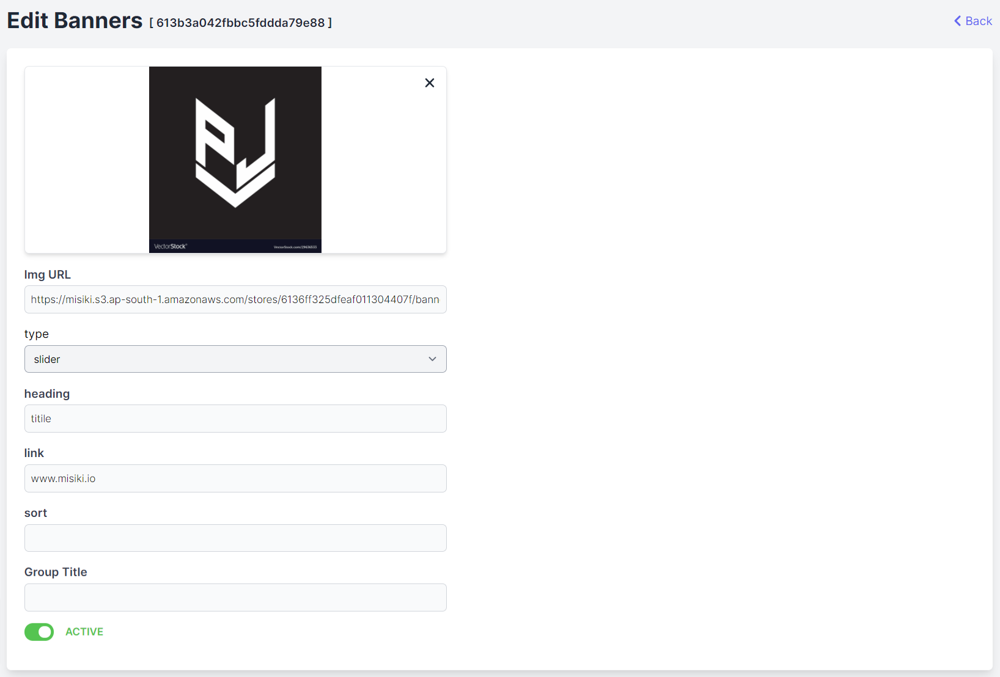

**Banners List**

- You can edit,clone and delete banner from here.

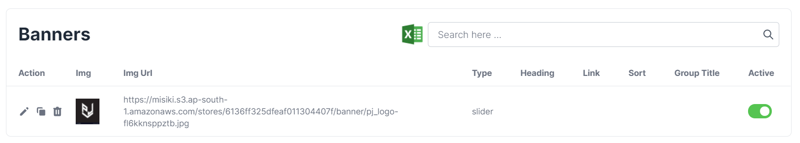

**Banner Export**

You can export all yours banners in the csv format by going to the manage banners page where the banners grid is displayed. On the right corner of the grid there is an excel logo from where the you can export the csv which will have grid columns.

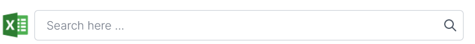

## Products

Products are the physical goods, digital files, and services that you sell. To create a product, you need to specify the name and upload product images. In addition, you can add product details that help your clients better understand the product. For example add available sizes, SKU, description, etc. You don't have to provide every detail for each product.

- From your Anne admin panel, in sidebar go to Products → All Products to view and edit product details.
- To add many products at once, you can upload products in bulk using a CSV-formatted import file.

### All Products

#### Adding a new product

- From your Anne admin panel, go to Products → All Products → Add New Product.
- Click on Add New Product button and it will redirect to product edit page.

##### Images/Video

- In this section images show your customers what your products look like. Here you can upload images of front, side, underneath, close-up, etc., so customers can see what they are buying in detail.
- The quality of your product images directly affects your ability to generate sales. Here are some tips

- Each product image should be of uniform size and style across all products you sell.
- Use high-quality images, so customers can see any fine details.

**For add Video link**

- Click on Add Image/Youtube Link at top right corner of the box and a small window pop up came, and here you can provide youtube link and click on submit.
- Video will be added to your product

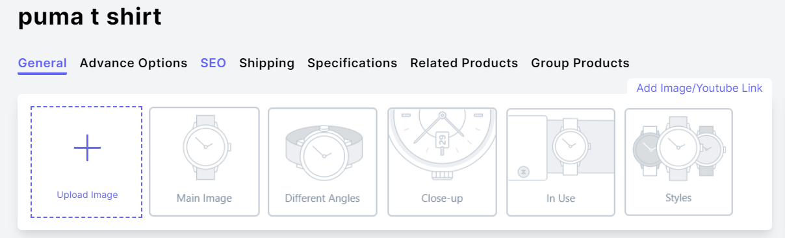

##### Name and description

**Name**

Name is a title for your product. When you name a product you should automatically make customers think about the most valuable components of your product, and what they can get when they buy from you.

**Description**

It emphasizes its advantages, lists its characteristics, or highlights product features. You may also use videos, images, and animated elements that help to describe your product. Write unique product descriptions so they rank higher in search engines.

Tips to improve your product descriptions

- Avoid long sentences and complex vocabulary, Imagine you are explaining the product to a child.
- Include product demo videos, Just by watching a person hold, touch, and interact with the product while explaining its pros and cons is the next best thing to visiting a store.
- Provide a short and long version of your description, Some people scan rather than read, some like to read more in-depth about your product, make sure you cover both types.

**Brand**

In brand you will have option for select brand, you can also create new brand via click on "Add New" button.

**Size**

In size you will have to choose size, you can also create new size in case your needy size is not available, then click "Add New" button. And you will be able to create it.

**Color**

In color section you can choose any color from board.

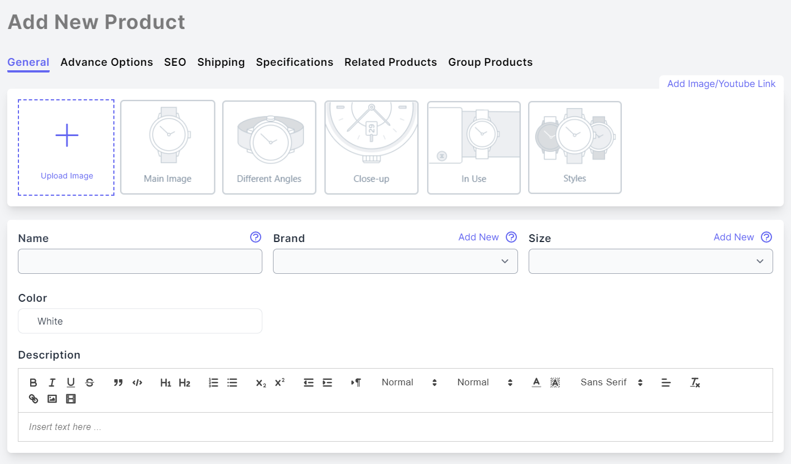

#### Advance Option

This section has some mini sections as follows

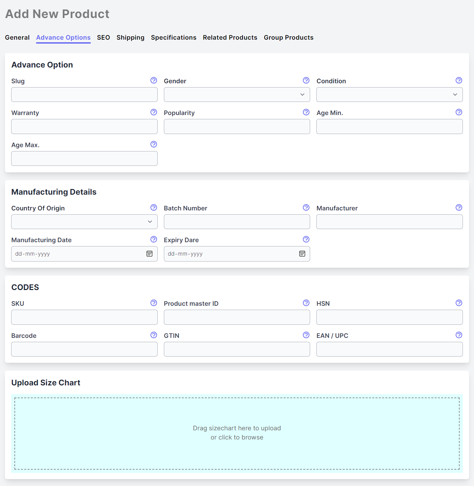

- In this section you can add fields
  Gender-> The gender of the product.
  Condition-> The condition of the product.(new/old/refurnished)
  Warranty-> The warranty of the product.
  Popularity-> Integer ranking 0 to --
  Age Min and Age Max-> If product is for specific age limit

##### Manufacturing Details

- In this you can select fields as follows
  Country Of Origin-> The country of origin of the product.
  Batch Number-> The batch number of the product.
  Manufacturer-> The manufacturer of the product
  Manufacturing Date-> The manufacturer of the product.
  Expiry Date-> Expiry of the product.

##### CODES

Code are very important fields in the product, because they identifies the product.

**SKU (stock keeping unit)**

The code that identifies the product within your business. You can use the product identification code provided by manufacturers or your own combinations of letters and numbers. Each SKU needs to be unique.

**Product master ID**

Product master id used for , when a product have options,like- multiple colors ,multiple sizes and more , then we will will save this unique id in all of common product. So product can be grouped easily.

**HSN**

Harmonized System of Nomenclature code (HSN Code) is used for classifying goods under GST.

**Barcode**

Barcodes are applied to products to quickly identify them. Among their many uses. In warehouses to track and manage inventory and on invoices to help with accounting.

**GTIN**

The Global Trade Item Number is an identifier for trade items, developed by GS1. Such identifiers are used to look up product information in a database which may belong to a retailer

**EAN / UPC**

EAN is a standardized barcode and marked on most commercialized products currently available at the stores

##### Size Chart

- Sizechart is a image, Size in general is the magnitude or dimensions of a thing.
- Gometrical size can refer to linear dimensions, area, or volume.
- Size can also be measured in terms of mass, especially when assuming a density range.

#### Product SEO

These settings allow you to set specific SEO-related information on your product's page. When analyzing a webpage, search engines get information about its content from the so-called “meta tags”. This includes the page title and meta description. Search engines use meta tags to describe pages as they appear in the search results and rank them by relevance.

Anne automatically generates metadata based on your product's name and its description. Search engines display a limited number of characters, so you may want to re-write the page title and meta description. Edit page title and descriptions with relevant keywords so your product appears higher in search engine results.

**Page title**

The title is shown as a clickable link in search results. You can customize the title to target your clients’ interests more accurately.

**Meta description**

A short sentence summarizing the content of the product. Write a more detailed text describing your product offer. Meta descriptions can be any length, but Google generally truncates snippets to ~155–160 characters.

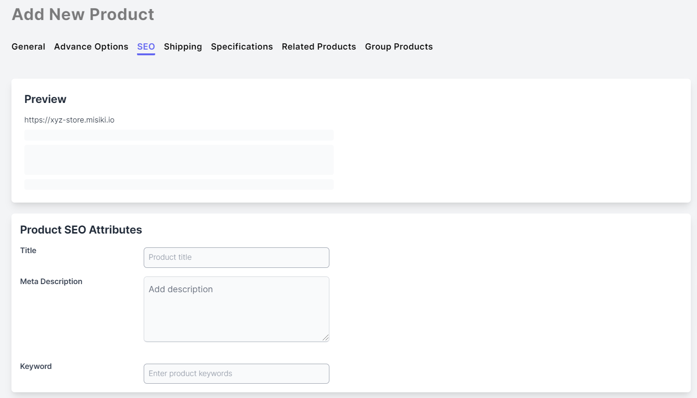

#### Shipping

This section will need in physical product only.

**Weight and Dimensions**

The product's actual weight and dimensions.

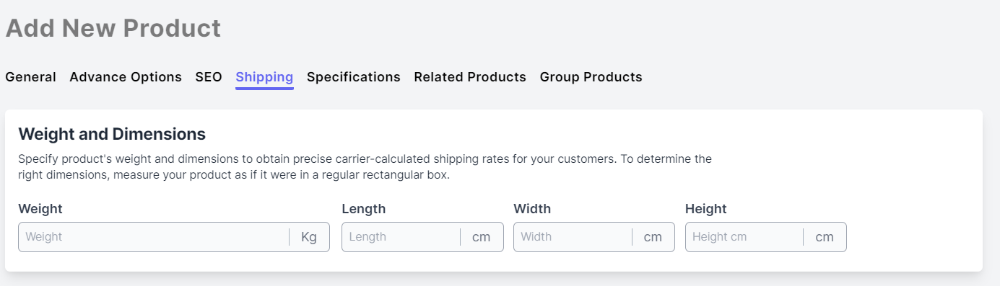

#### Specifications

Product categories have some attributes and when product select the category , then product have access of that category attributes.

For ex- Television categories have attributes like- In the box, charger type.
Whenever you select the Television category , it will automatically show all the attributes of the category, and then you can easily fill them.

**Add specifications for product**

- Select Attribute Type(categories) from the drop down. If there is no attribute then create it via click on Add New feature.
- After selecting the attribute type, now select the feature and fill the value of the feature.

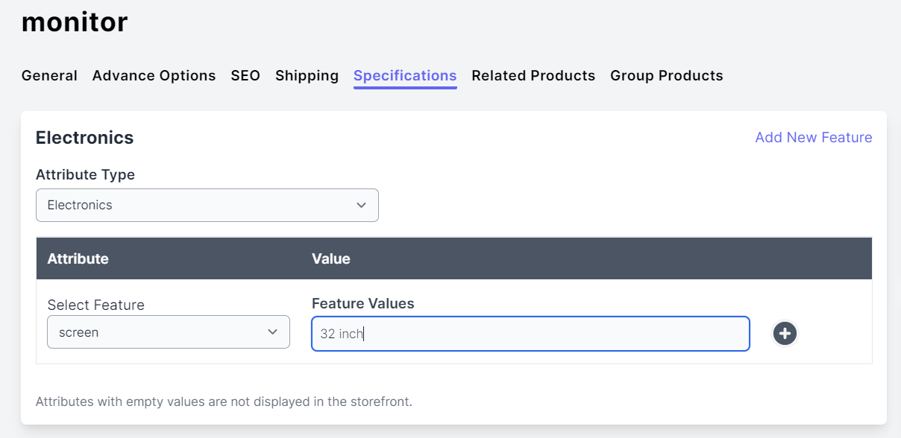

#### Related products

Some products complement each other well and it’s best to buy them together. Use the related products feature to display the You may also like section in your online store as well as to cross-sell products in the cart. This feature helps you promote certain products and encourages customers to buy more.

- From your Anne admin panel, go to Products.
- Open the product page where you wish to recommend related products.
- Open the Related Products tab.

**Display specific and random products**

- In specific product you can selct the product .
- If you want random product then you can enable the button of Display random products.

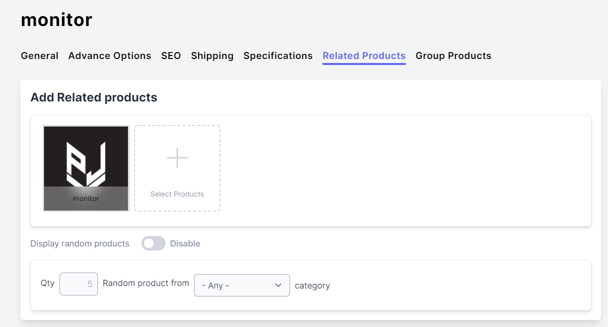

#### Group Products

- When two or more products have common master id then other products will shown here with images.
- On click of product ,you can move to those edit page also.

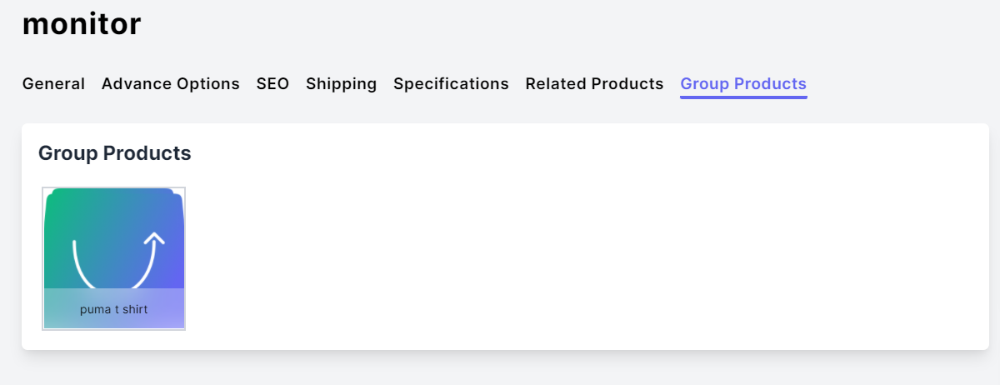

#### Product Pricing

**Discount Price**

A price that you're charging for the product.

**Price**

A price is mrp(marketing price).

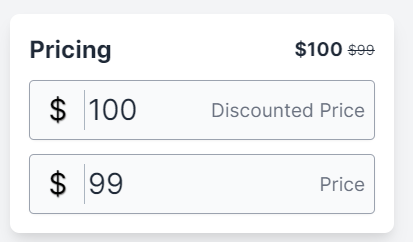

#### Product Categories

- In product edit go to right bottom categories section.

  - Categories help customers to faster navigate through the store and find the products as per their need.
  - Categories are groups of products that a product is included in. The product can be assigned to one category or several categories.

- In this section choose the categories.

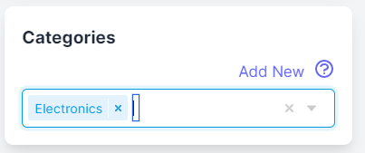

#### Product ribbons

- In product edit go to right bottom Product Ribbons section.

- Product ribbons are colored labels that are displayed in your catalog above product images. They can help visually highlight certain products on your storefront. These tags contain your custom text.

**You have for ribbons to edit**

- Active
- Featured
- Hot
- New
- Sale

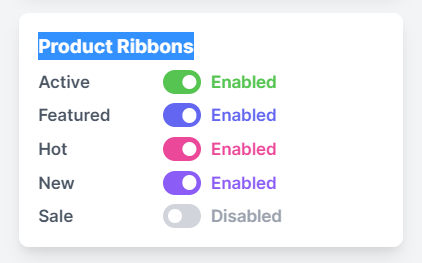

#### Product Inventory

**Stock Control**

- If you have a limited number of this product to sell, use the stock control section to specify the quantity in stock.

#### Product Preview in store

Click Preview Product to see how this product will look in your online store.

### Categories

- Categories is an important and essential feature which provide a relief to the customer to select and shop according to their requirement. A product can belong to multiple categories at a time. (for example, Fashion,Electronics )

- Categories uses tree structure mean categories are defined on several levels. And toppest level categories called as root categories. You can create root categories,and then also create categories on second, third, etc. level within your root category. They are referred to as subcategories or child categories.

- You will see all categories in tree structure. And by clicking on any category you will be able to edit the category.

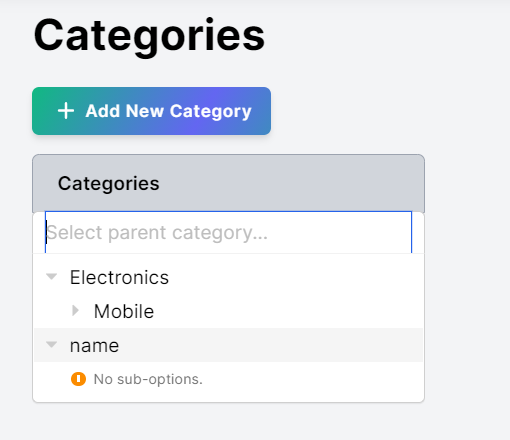

#### Create category And Edit category

- From your Anne admin, panel sidebar go to Products → Categories.
- Click Add New Category.

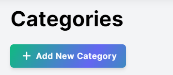

- Fill the category details as per your need.

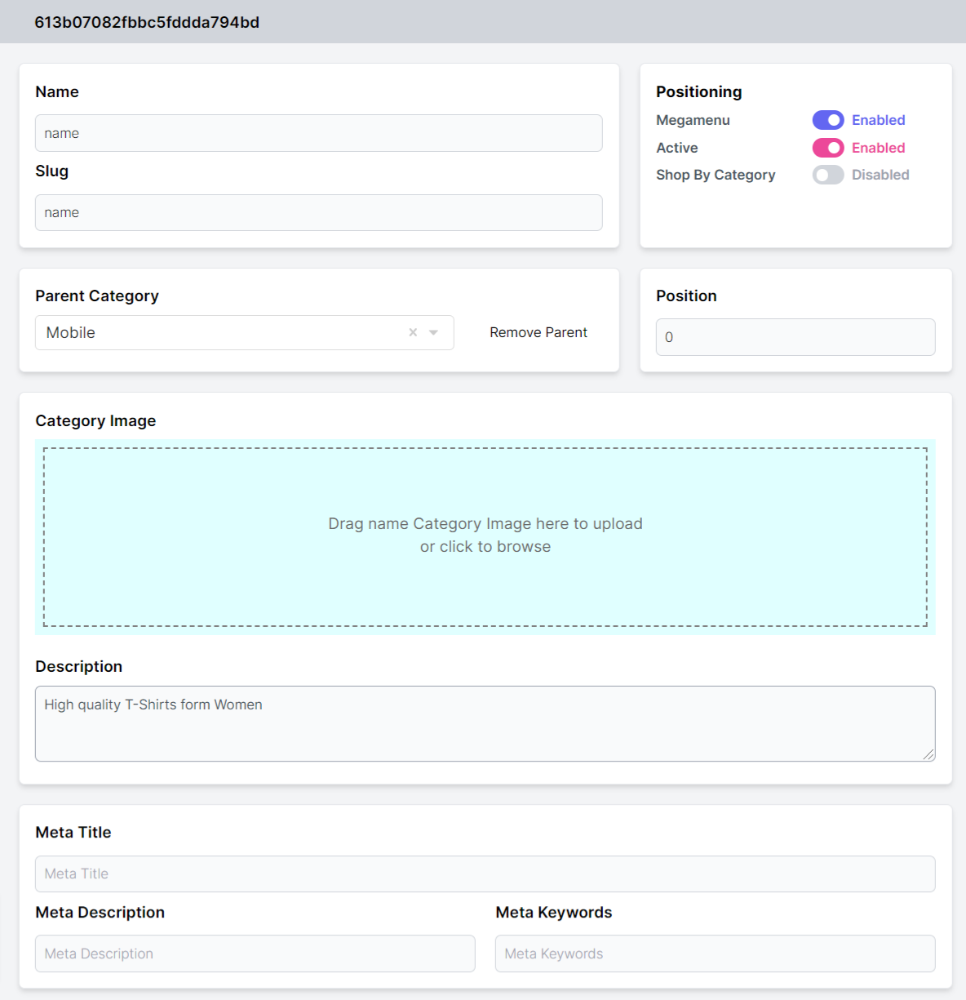

- In case you want to create a root category, you don't have to select parent category field.
- In case you want to create sub category , you can choose a parent category.

- Click Category image to upload an image for your category. You can upload an image that represents your category or an image of a product from the category.

- Enter the description. You can describe what kind of products are in that category, or just leave it blank.

-And you can also enable category features like- megamenu,active.

- Edit category is same as create new category, just select the category in tree which you want to edit. Now you can update fields.

### Reviews

Review is the nothing but a comment box in which customers give their reviews about the product that they have ordered & used. In this the customer gives some ratings to the product in a form of stars and message.

- In Sidebar, Go to Products → Reviews.

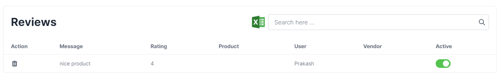

- You can disable and delete review from here.

**Review Export**

- You can export all yours reviews in the csv format by going to the manage reviews page where the review grid is displayed. On the right corner of the grid there is an excel logo from where the you can export the csv which will have grid columns.

### Popular Searches

Popular Searches used for better navigation in product for customer.

- In sidebar, Go to Products → Popular Searches.

**Create new Popular Searches**

- Click on plus icon for create new popular Search.
- Now you can fill name and popularity.
- Click on save icon at right side of bottom.

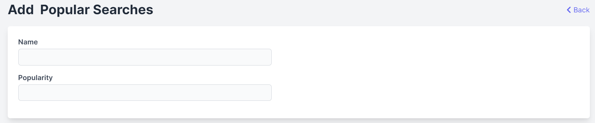

**Popular searches List**

- You can edit,clone and delete popular searches from here.

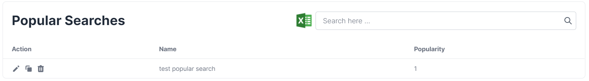

**Popular Searches Export**

- You can export all yours popular searches in the csv format by going to the manage popular searches page where the popular searches grid is displayed. On the right corner of the grid there is an excel logo from where the you can export the csv which will have grid columns.

### Brands

In the brand section there are the brands of the different product that are available in the store can be seen.
Brand used for better navigation in product for customer.

- In sidebar, go to Products → Brands.

**Create new Brand**

- Click on plus icon for create new brand.
- Now you can fill fill form of brand, you can also provide social media link of the brand.
- You can also upload image of the brand.
- Click on save icon at right side of bottom.

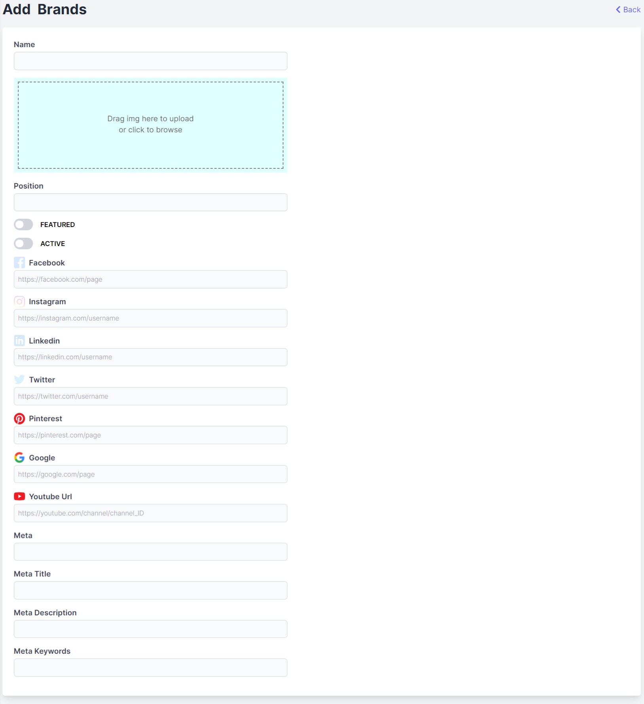

**Brands List**

- You can edit,clone and delete brand from here.

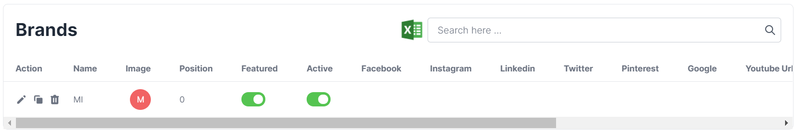

**Brand Export**

- You can export all yours brands in the csv format by going to the manage brands page where the brands grid is displayed. On the right corner of the grid there is an excel logo from where the you can export the csv which will have grid columns.

### Sizes

In the size section there are the sizes of the different products. Its like variant of the product , means single a product is available in multiple sizes.

- Customer can choose the product size accoring to his/her need.

- In sidebar go to Products → Sizes.

**Create new Size**

- Click on plus icon for create new size.
- Now you can fill fill form for size details.
- Click on save icon at right side of bottom.

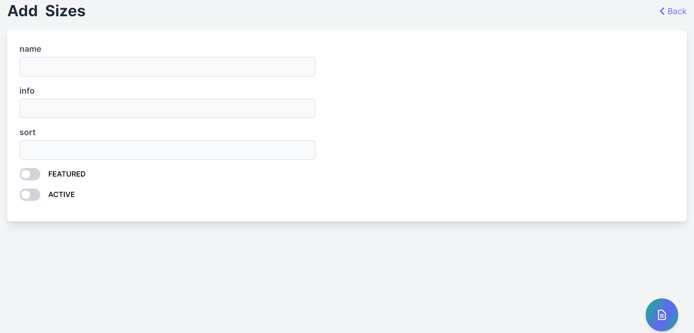

**Size List**

- You can edit,clone and delete size from here.

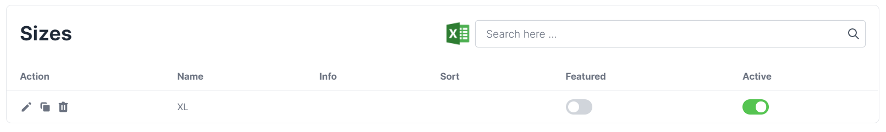

**Size Export**

- You can export all yours sizes in the csv format by going to the manage sizes page where the sizes grid is displayed. On the right corner of the grid there is an excel logo from where the you can export the csv which will have grid columns.

## Import And Export

- In import you can add product and category in bulk.
- In Export you can get data in csv format file and also able to download it.

### Import Product

- Product create one by one take a lot of time so for add product in bulk import product comes handy.
- Product import in store through is the fastest way to upload catalog or make bulk changes to products in an existing Anne store catalog.
- When importing, Anne converts the data from the uploaded import file into products in your online store.
- Only CSV format file allowed to import.
- You can also see the sample import file format.

- Once you’ve prepared your CSV file, you can import it into your store

  - In sidebar, go to Import/Export → Import Product.
  - Click Import Products.
  - Click Choose file and select the CSV file from your computer.
  - After Sumit file wait for somtime and you will see all products thorough import details.

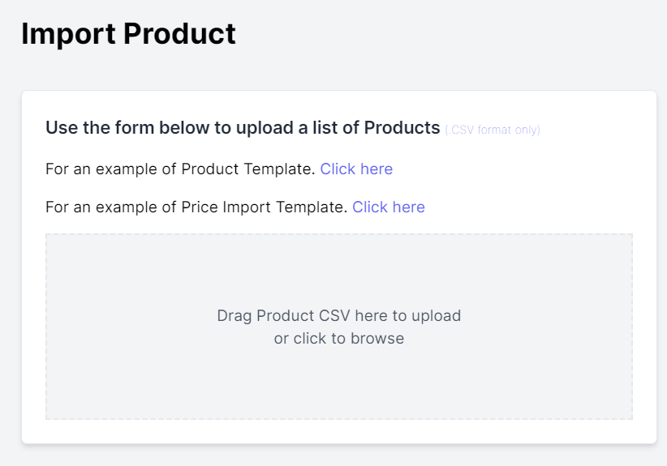

#### Import Details

- Import detail is at the same page of import product.
- You can see each raw information of the product ,like what happen to what raw.
- At the time of tracking you can also refresh the details by clicking on refresh button at right bottom corner.

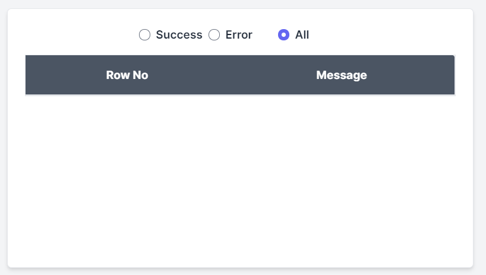

### Import Category

- Import Category is same as import product, in case you want to add categories in bulk you can use this.
- Import Category sample format link also there.
- In sidebar, go to Import/Exxport → Import Category.
- When you csv file ready then choose file and upload it.

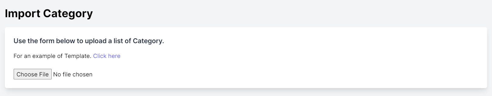

### Export

- Whenever you want to take a backup of your store , in that case you can use export feature.
- This feature will export file in csv format. And you can upload this file to anne.
- You can export Products, Brands, Categories, Features, Sizes, Users and Orders.
- You can apply filters and you can export data as per your choise.
- When you click on Export All, automatically a csv file will download into your system with data.

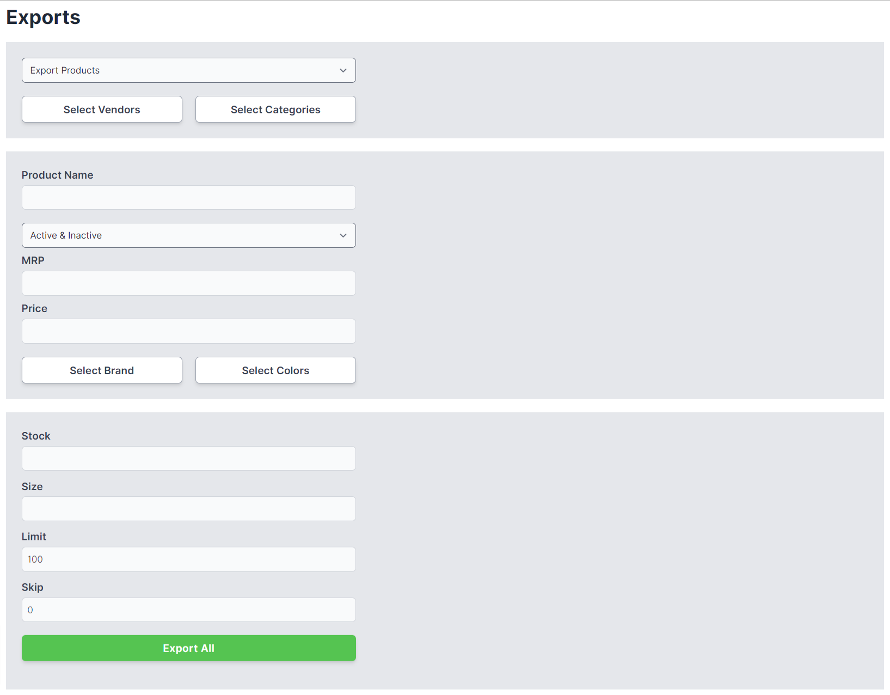

## My Sales

### Orders

#### Search and filter orders

- Orders can be found in the left sidebar on “mysales → Orders” link.

- By default, your orders list is organized from relevance. If you have a large number of orders, then you can use the search bar above the order list to find an order by customer detail, order id.

- You can also filter your orders by

  - Date
  - Payment status
  - Payment mode
  - filter through the status

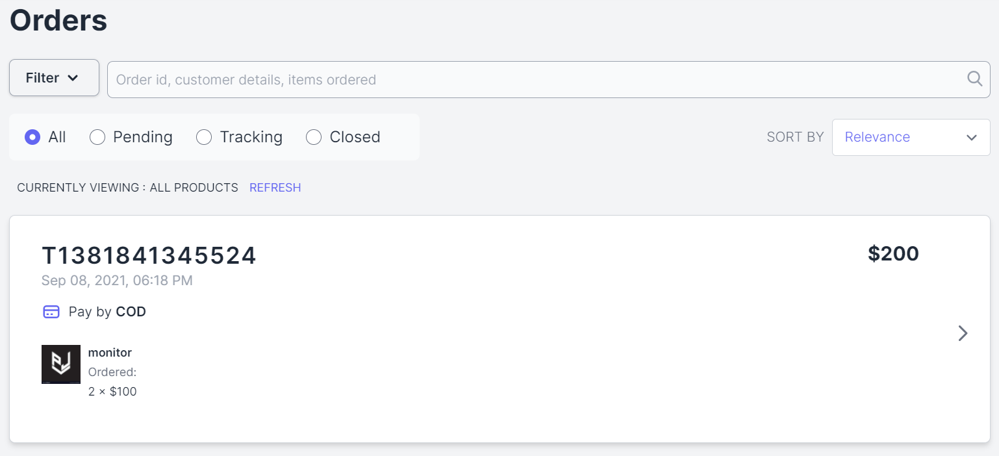

#### Update order

In Order list when click on any order right at arrow sign.

  
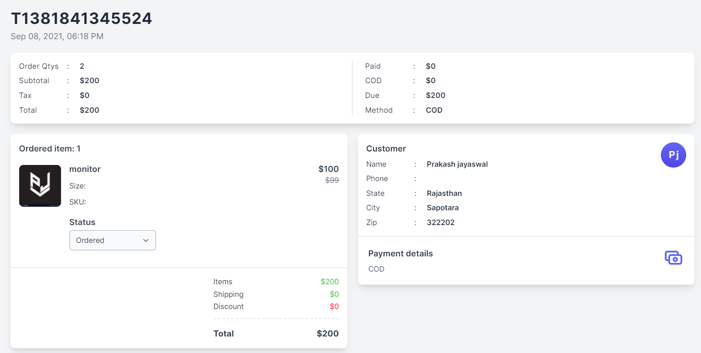

- The order view page of the vendor is shown above. Here different block are available which
  show all the information related to the order.

**Order Details**

- Order No-> It will show the order Number in top left corner start from 'T'.
- Order Date & Time-> Date and time on which the order was placed on the site.
- Order Qtys-> It will show the total qty of the order.
- Subtotal-> It will show the total amount of item without tax, shipping charge and discount of the order.
- Tax-> It will show the total tax of the order.
- Total-> It will show the total amount items, tax, shipping charge and discount of the order.
- Paid-> It will show the total paid ampount of the order.
- COD-> It will show the total cod amount (only in cod case) of the order.
- Due-> It will show the total due amount of the order.
- Method-> It will show the payment method of the order.

- Ordered item-> This information will show how many products are ordered with there amount ,quantity and status
- Status-> In order status vendor can update the status of the order.

- Customer-> Name and address of the customer will show up in this block.
- Payment Details-> The payment method selected to place the order.

### Abandoned Carts

- Abandonment Carts is an ecommerce feature where vendor can see all the abandoned cart ,and m anage them.
- Abandoned cart is cart of customers who add items to their online shopping cart, but exit without completing the purchase.

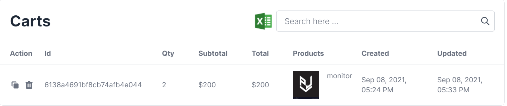

- You can use the searchbar for filter.

**Cart Export**

- You can export all yours carts in the csv format by going to the manage abandoned cart page where the cart grid is displayed. On the right corner of the grid there is an excel logo from where the you can export the csv which will have grid columns.

### Payments

#### Payment List

- Payment section shows the payments list with details about the order customer have placed through the account.
- It gives us the information about the customer , payment status and orderId.

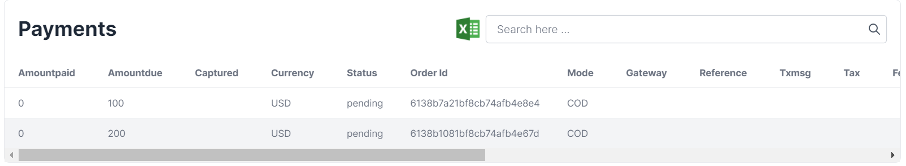

- You can use the searchbar for filter.

**Payment Export**

- You can export all yours payments in the csv format by going to the list page where the payment grid is displayed. On the right corner of the grid there is an excel logo from where the you can export the csv which will have grid columns.

**Payment attribues**

- Amountpaid->It will show the amount that has been paid to the user.
- Amountdue->It will show the amount that has been due to the user.
- Captured->It will show the amount that has been captured via the user.
- Currency-> It will show the currency of amount.
- Status-> It will show the status of the payment.
- Order Id-> It will show the order id of the payment.
- Mode->It will show the payment mode to the user i.e. by which mode
- the payment has been made to the user. like cod, online
- Gateway->It will show the payment gateway used to paid.
- Reference
- Txmsg-> It will show the transaction message.
- Tax->It will show the tax amount.
- Fee-> It will show the transaction fee.
- Txtime-> It will show the transaction time.
- Email-> It will show the email address of the user.
- Contact-> It will show the contact address of the user.
- Invoice No-> It will show the invoice number of the order.
- Error Code-> It will show the error if failed.
- Error Description-> It will show the error description of the error.
- Date-> It will show the date on which the customer has made the payment.

### Wishlists

- Wishlist is a simple listing feature available on Anne app, It lets customer to add and collect all the items that customer wish to purchase. All the products that customer want to own can now be put up in one easy-to-reach destination.

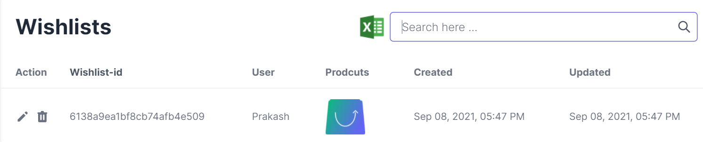

- You can use the searchbar for filter.

**Wishlist Export**

- You can export all yours wishlist in the csv format by going to the list page where the wishlist grid is displayed. On the right corner of the grid there is an excel logo from where the you can export the csv which will have grid columns.

## Customers

#### User List

- In the customer section you can see the list of all users who registered on your store.

- Through this you can easily contact users by the phone number and other details like their mail id and the designation that they are bearing here.

- You can export the users list in csv format via click on sheet logo.
- You can see photo of every user that is active and are performing any role in the website.
- You can verified and active the user from here.

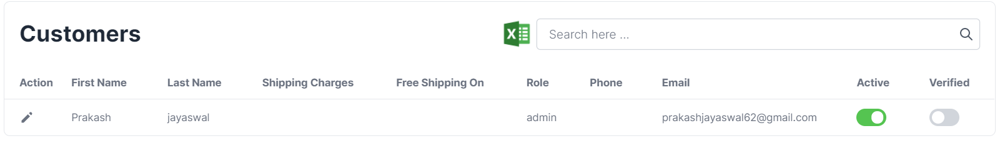

#### Searching and Export customers

- Use the Search bar on the Customers page to search for customer name and email.

**To search customers**

- From your Anne admin panel, go to Customers.
- Search for a full name or email address.

**To export customers**

- You can export the whole of your customer list.

**To export specific customer list**

- From your Anne admin panel, go to Customers page.
- Click on the Excel logo.
- As a result, a CSV file will be downloaded to your computer.

#### Edit Customers

You can change an existing customer profile to update their information.

**To edit a customer’s information**

- From your Anne admin panel, go to Customers.
- Click the pencil icon of the customer profile you want to edit.
- In the Edit customer dialog, you can change a customer’s

  - firstName and lastName
  - email address
  - Shipping Charges(in role vendor)
  - Free Shipping On(in role vendor)
  - Role
  - active and verified
    Click Save to confirm your changes

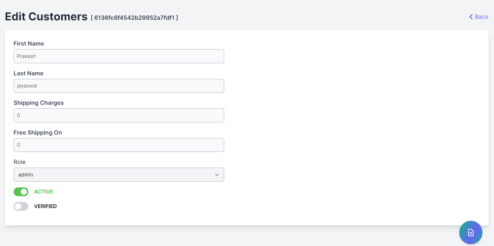

## Monitoring

- Monitoring is feature which allows you to monitor your product.
- In sidebar, go to monitoring.

**Through this you can see the list of products of**

1. No Stock
2. No Image
3. No Price
4. Invalid Price
5. No Description

- You can edit and delete these product from here.
- You can also add new product from here via click on plus icon.
- You will see product like these

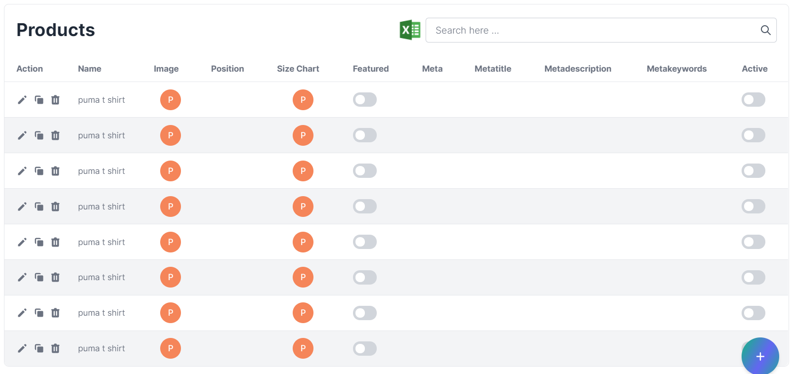

## Utilities

Utility is an important characteristic of business is the creation of utilities is goods so that consumers may use them.

### Blogs

- A blog is a discussion or informational of store features.
- From your admin panel go to Utilities → Blogs in sidebar.
- You will see the list of blogs here.

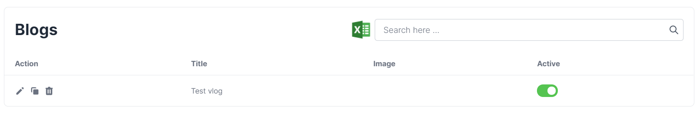

**Create/Edit Blog**

- For create blog click on add icon at the bottom of right side, and it will redirect to blog edit page.
- Now you can able to create blog.
- For edit blog click on pencil icon of blog on the listing page and you will redirect to blog edit page.
- After update details click on save icon.

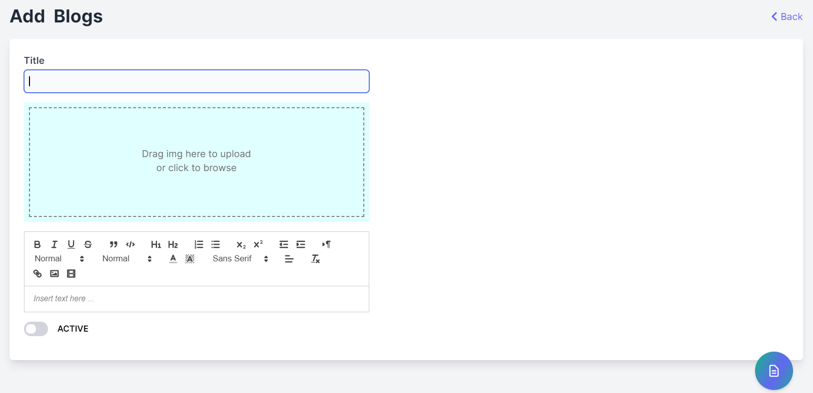

**Blog Export**

- You can export all yours blogs in the csv format.
- Click on top right corner at excel logo of the listing page.
- And a csv formatted file will download in your system, which will have data in grid columns.

### Frequently Asked Questions (FAQ)

- FAQ's are series of questions paired with answers, that provides basic information.
- These are very helpful for customers to find their resolutions easily.
- From your admin panel go to Utilities → FAQ in sidebar.

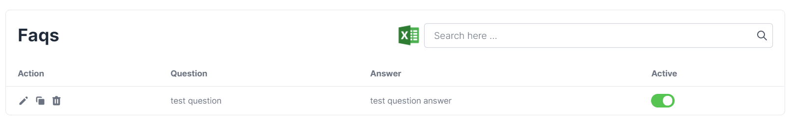

**Create/Edit FAQ**

- For create FAQ click on add icon at the bottom of right side, and it will redirect to FAQ edit page.
- Now you can able to create FAQ.
- For edit FAQ click on pencil icon of FAQ on the listing page and you will redirect to FAQ edit page.
- After update details click on save icon.

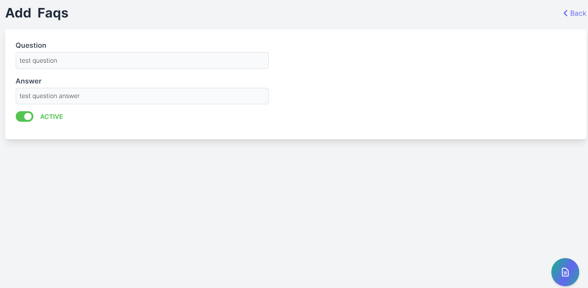

**FAQ Export**

- You can export all yours fequently asked questions in the csv format.
- Click on top right corner at excel logo of the listing page.
- And a csv formatted file will download in your system, which will have data in grid columns.

